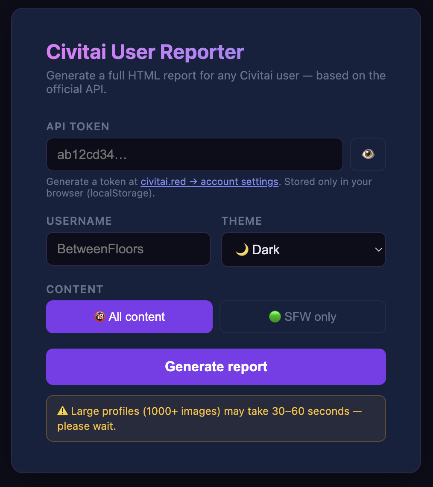
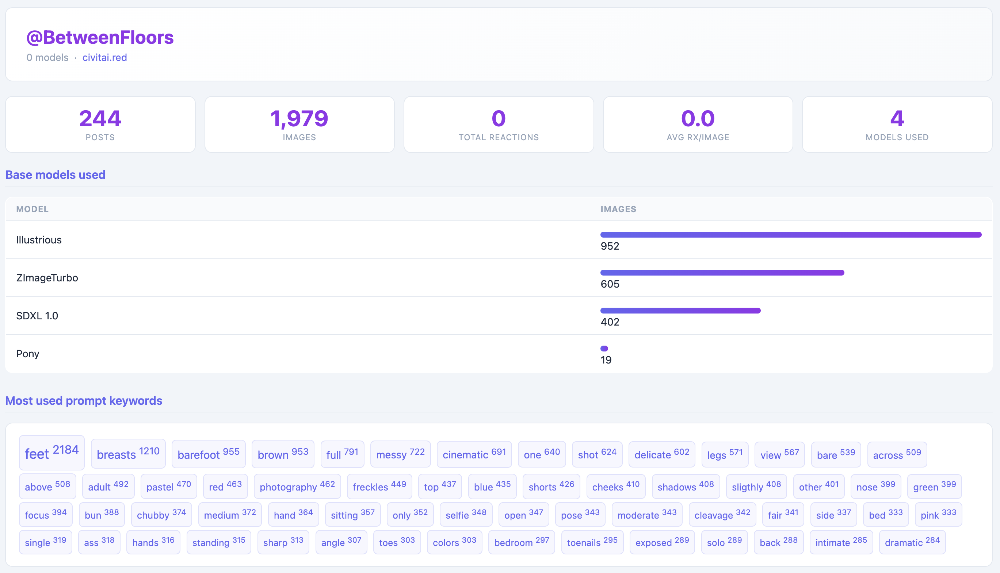

# civit_users

Python tool to generate a self-contained HTML profile report for any Civitai user.

> **Note:** Uses the official Civitai REST API (`civitai.com/api/v1`). Only public information accessible through the API is retrieved. All processing runs locally — nothing is uploaded anywhere.

## Requirements

- Python 3.10+
- `requests`

## Installation

```bash
git clone https://github.com/BetweenFloors/civit_users.git
cd civit_users
pip install requests
```

Get your API token at **civitai.red → account settings → API keys**.

## Usage

### Web UI (recommended)

```bash
python server.py
```

Opens `http://localhost:8000` automatically. Enter your API token, a Civitai username, choose a theme — the report opens in a new tab.

> **⚠️ Note:** Large profiles (1000+ images) may take 30–60 seconds to generate. Please wait.

### Python

```python
from fetch import fetch_all
from report import generate_html

data = fetch_all("YOUR_TOKEN", "SomeUsername")
generate_html(data, "SomeUsername", "report.html", theme="dark")
```

## Report contents

| Section | Description |
|---|---|
| Stats grid | Posts, images, total reactions, avg reactions/image, models used |
| Base models | Bar chart of most used base models |
| Prompt keywords | Top 60 most used words across all prompts |
| Images per month | Submission activity timeline |
| Image gallery | All images, paginated (64/page), sortable by date or reactions |

## Example report

→ [example_BetweenFloors.html](examples/example_BetweenFloors.html)

## Limitations

Reaction counts (likes, hearts, etc.) are not always available via the official API. For some accounts, Civitai stores reactions at the post level rather than per-image, so individual image stats may show as 0. This is a platform-side limitation — the data is simply not exposed through the public API for those users.

## How it works

All processing runs locally. The tool fetches data directly from `civitai.com/api/v1/images` using your token — nothing goes through a third-party. The local server exists only to bypass browser CORS restrictions; the generated HTML is self-contained and never uploaded anywhere.

## Screenshots





